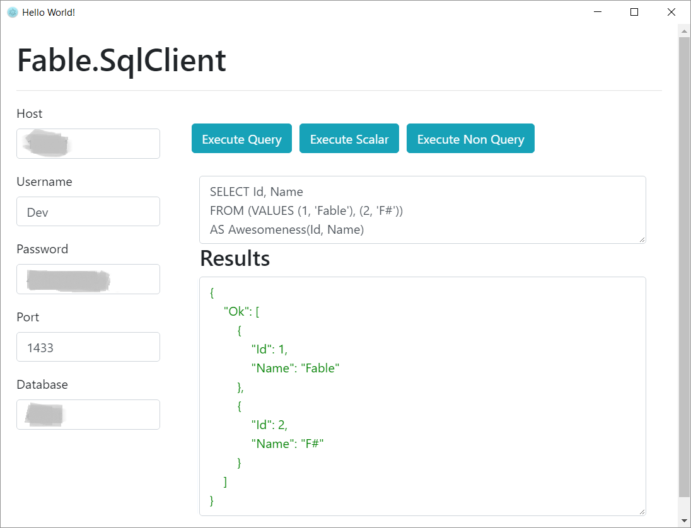
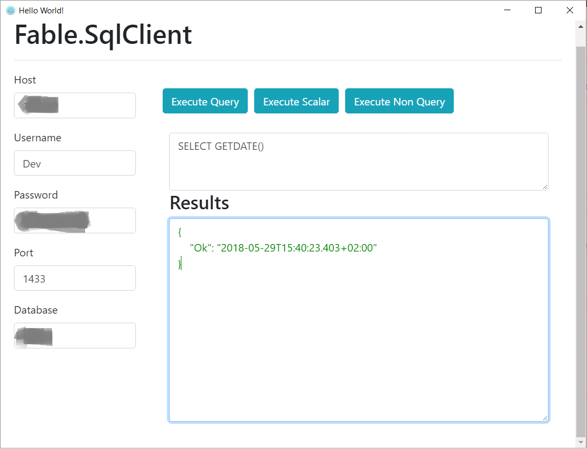
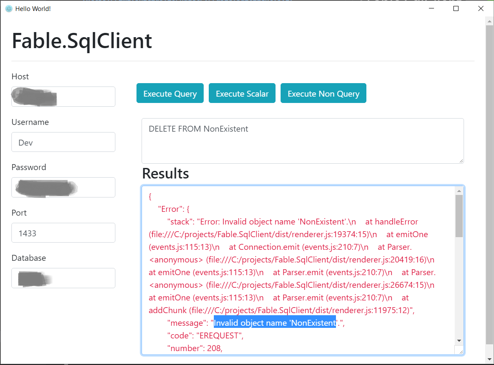

# Fable.SqlClient [](https://www.nuget.org/packages/Fable.SqlClient)


[Fable](https://github.com/fable-compiler/Fable) binding for [node-mssql](https://github.com/tediousjs/node-mssql), Microsoft SQL Server client library with an idiomatic F# API to be used from Fable Node applications. 

### Installation
Install the Fable binding from Nuget
```
paket add Fable.SqlClient --project /path/to/project.fsproj
```
Install the actual node-mssql from Npm
```
npm install --save node-mssql
``` 
# Getting started
First of all, configure the connection:
```fs
open Fable.SqlClient

let connectionConfig = 
    [ SqlConfig.User "admin"
      SqlConfig.Password "str0ngPa$$word"
      SqlConfig.Host "localhost"
      SqlConfog.Port 1433
      SqlConfig.Database "AdventuresWorks" ]
```

When we execute queries, the result sets we get back from the native client is a simple object literal, so we can simply model a row of the result as a (pojo) record:

```fs
type User = 
  { Id: int
    Name: string
    DateModified: Option<DateTime> }
```

Nullable columns can be naturally represented as values of type `Option<'t>` because `null` values of the object litetal that we get back correspond to `None` and otherwise it will be `Some value`.

## SqlClient.query<'t>
Now let us query some values:
```fs
// to use promise api's
open Fable.PowerPack

// unit -> Promise<Result<User list, string>>
let getAllUsers() = 
    promise {
        // get the shared connection pool
        let! pool = SqlClient.connect connectionConfig
        
        let request = SqlClient.request pool
        let usersQuery = "SELECT Id, Name, DateModified from Users"
        
        let! usersResult  = SqlClient.query<User> usersQuery request
        match usersResult with
        | Ok users -> return Ok (List.ofArray users)
        | Error detailedSqlError -> 
            // log the error:
            printfn "%A" detailedSqlError
            return Error "Could not load users from the database"
    }
```
Notice how the type of the record is supplied to `SqlClient.query<'t>` function. It's signature is as follows:

```fs
query<'t> : string -> ISqlRequest -> Promise<Result<'t[], SqlError>>
```
`query<'t>` is safe and does not throw exceptions

## SqlClient.executeNonQuery
The same as .NET's `SqlReader` that returns the number of affected rows of a query:

```fs
// unit -> Promise<bool>
let deleteEvents() = 
    promise {
        let! pool = SqlClient.connect connectionConfig
        
        let request = SqlClient.request pool
        let query = "DELETE FROM Events"
        
        let! deletionResult = SqlClient.executeNonQuery query request
        match deletionResult with 
        | Ok rowsAffected -> return rowsAffected > 0
        | Error sqlError -> return false
    }
``` 
Signature of `SqlClient.executeNonQuery`:

```fs
executeNonQuery : string -> ISqlRequest -> Promise<Result<int, SqlError>>
```
`executeNonQuery` is safe and does not throw exceptions
## SqlClient.executeScalar<'t> 
Executes a query that returns a scalar value of type `'t`:

```fs
// unit -> Promise<Option<DateTime>>
let pingDatabase() = 
    promise {
        let! pool = SqlClient.connect connectionConfig
        
        let! serverTimeResult = 
            SqlClient.request pool  
            |> SqlClient.executeScalar<DateTime> "SELECT GETDATE()"  
        
        match serverTimeResult with 
        | Ok serverTime -> return Some serverTime
        | Error sqlError -> return None
    }
```
The signatue of `SqlClient.executeScalar<'t>`
```fs
executeScalar<'t> : string -> ISqlRequest -> Promise<Result<'t, SqlError>>
```
# Bonus

This repo contains an electron application with the UI written with Elmish and using the library to talk to my test databases: 

### Query result set


### Scalar result


### Error result


### Requirements
 - Dotnet 2.0
 - Mono
 - Node


Running the watching the tests live 
```sh
./build.sh RunLiveTests 
```
Building the tests and running QUnut cli runner
```sh
./build.sh RunTests
```
or just `Ctrl + Shift + B` to run the cli tests as a VS Code task